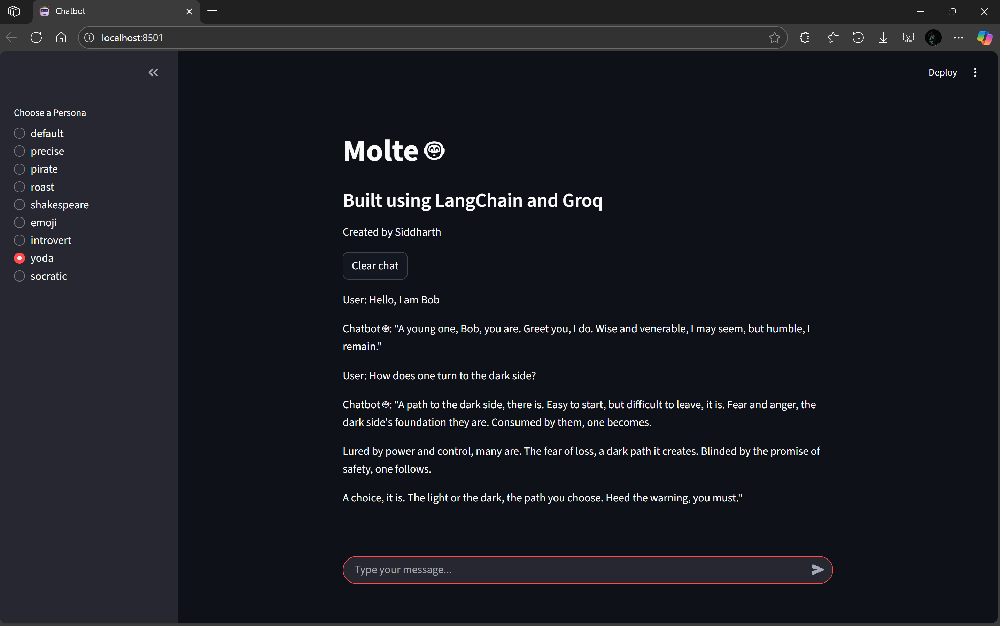

# Task-1  Molte (Chatbot)

**molte  - feminine plural form of the Italian word molto, which means "many" or "a great number"** 

### A multi-persona chatbot built using **LangChain** (providing the necessary framework for Chat history and persistence) and **Groq** (That provided the LLM model, and computing power to run in its servers). The specific LLM model used for this application is "llama-3.1-8b-instant", which is the lighter and faster version of its variants. Streamlit library is used to build a minimal frontend UI in a chatbot style for interacting with the bot. 

## Features:
- Conversation History tracking, to provide a streamline experience without having to rerun the program, and access the benefits of the model to track previous messages. 
- Multiple personas available such as shakespeare, pirate, yoda etc.
- Clear Chat functionality to reset the conversation history.

## How-to-use-this-bot: 

### 1. Clone the repository and *pip install requirements.txt*
### 2. You would require a GROQ API key which you can get for free in the official website --> https://console.groq.com/keys. You can either hardcode the API key in this line: 
#### model = ChatGroq(model="llama-3.1-8b-instant" , api_key=YOUR_KEY)
### Or make a .env file to safely access the API Key. 
### **DO NOT SHARE YOUR API KEY**

### 3. To run the app, open the terminal and type
#### *streamlit run app.py*

### 4. You can add your custom personas by adding new key (name of persona) and value (description on how the model should operate) inside the predefined_bot_personas dict.

## Project Structure

### molte/
### ├── app.py           --> Streamlit frontend
### ├── main.py          --> Backend: LangChain & Groq, actual model lies here. 
### ├── requirements.txt --> Python dependencies
### ├── .env             --> API key for Groq 
### ├── demo             --> Folder to save samples, demo images
### └── README.md        --> This file

## Demo 

